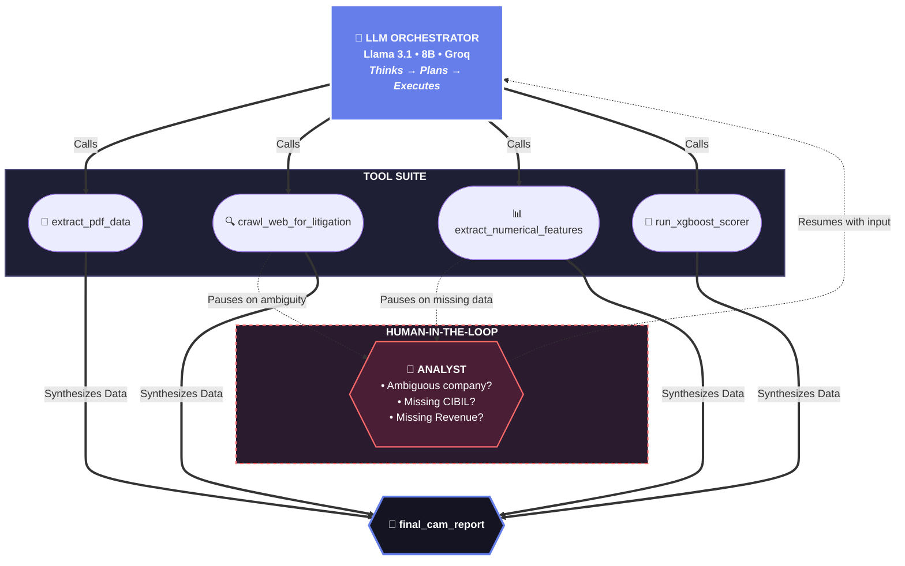

<div align="center">

# 🏦 CREDI-MITRA

### AI-Powered Corporate Credit Appraisal System

*Bridging the Intelligence Gap through Agentic Underwriting*

[](https://credibmitra-ai.streamlit.app/)
[](https://www.python.org/)
[](https://langchain-ai.github.io/langgraph/)
[](https://xgboost.readthedocs.io/)

</div>

<br/>

---

<br/>

## 📖 About

**CREDI-MITRA** is an AI-powered Credit Decisioning Engine that automates the end-to-end preparation of a Comprehensive Credit Appraisal Memo (CAM). It ingests multi-format data (**PDF, CSV, XLSX**), conducts deep secondary web research (DuckDuckGo & BeautifulSoup), and leverages an XGBoost ML model to recommend whether to lend, an optimal credit limit, and the risk premium.

> **💡 Core Innovation:** Instead of a fixed pipeline, an LLM Agent dynamically decides what to do next, asks the analyst for help when data is ambiguous, and shows every intermediate step transparently in a chat environment.

<br/>

---

<br/>

## 🏗️ System Architecture

<div align="center">



</div>

## ✨ Key Features

*   **🧠 ReAct LLM Orchestrator:** Powered by Llama 3.1 via Groq. The agent dynamically decides which tools to call, rather than following a rigid pipeline.
*   **🤝 Human-in-the-Loop (HITL):** The system pauses execution to ask the human analyst for clarification when data is missing or ambiguous (e.g., multiple companies found, missing CIBIL score) before resuming the analysis.
*   **🌐 Multi-Source Data Ingestion:** Extracts data from uploaded files (**PDF, CSV, Excel**) and performs web-scale secondary research (NCLT filings, news sentiment).
*   **🤖 XGBoost Credit Scoring:** A custom ML model computes the probability of default, recommends an approved limit, and sets a dynamic interest rate based on risk premiums.
*   **📄 Automated CAM Generation:** Synthesizes all gathered data, financial metrics, and ML decisions into a final, downloadable PDF Credit Appraisal Memorandum.

## 🤖 Machine Learning Engine

CREDI-MITRA uses a pre-trained **XGBoost Classifier** to evaluate credit risk, trained on 5,000 synthetic corporate credit records.

*   **Accuracy:** 97%
*   **Features Analyzed:** Company Age, CIBIL Score, GST Revenue, Bank Inflow, Litigation Count, and News Sentiment.
*   **Decision Outputs:**
    1.  **Approval Decision** (Approved / Rejected)
    2.  **Recommended Limit (₹)** (Scaled by CIBIL and inflows)
    3.  **Dynamic Interest Rate (%)** (Base Premium + Risk Premium)

## 🛠️ Tech Stack

<div align="center">

| Layer | Technology | Role |
|:------|:-----------|:-----|
| 🧠 **LLM** | Llama 3.1 8B via [Groq](https://groq.com) | Central reasoning & orchestration |
| 🔗 **Agent Framework** | [LangGraph](https://langchain-ai.github.io/langgraph/) | ReAct agent, tool calling, interrupt/resume |
| 🖥️ **Frontend** | [Streamlit](https://streamlit.io/) | Chat interface, document upload, PDF export |
| 🤖 **ML Engine** | [XGBoost](https://xgboost.readthedocs.io/) | Credit risk classification (97% accuracy) |
| 📄 **Data Parsing** | [pypdf](https://pypdf.readthedocs.io/) + [Pandas](https://pandas.pydata.org/) | PDF extraction & Tabular data (CSV/XLSX) processing |
| 🐍 **Language** | Python 3.10+ | Core application |

</div>

<br/>

---

<br/>

## 🚀 Quick Start

### Prerequisites

- Python 3.10+
- [Groq API Key](https://console.groq.com) (free tier available)

### Setup

```bash
# 1. Clone
git clone https://github.com/ShivamMaurya14/CREDI-MITRA.git
cd CREDI-MITRA

# 2. Install
pip install -r requirements.txt

# 3. Configure — create .env file
echo 'GROQ_API_KEY=gsk_your_key_here' > .env
echo 'GROQ_MODEL=llama-3.1-8b-instant' >> .env

# 4. Launch
streamlit run app.py
```

## 🎮 Usage Guide

| Step | Action | Details |
|:----:|:-------|:-------|
| **1** | 🔐 Login | Authenticate with `admin` / `password` |
| **2** | 📊 Dashboard | View portfolio metrics, click "New Application Analysis" |
| **3** | 📁 Upload | Upload required documents in the sidebar |
| **4** | 🧑‍💼 Officer Notes | Add field visit notes or upload officer report |
| **5** | 🚨 Submit | Click "Submit to Agent" to initialize |
| **6** | 💬 Chat | Type `"start analysis"` to trigger the LLM orchestrator |
| **7** | ⏸️ Respond | Answer any clarification questions from the agent |
| **8** | 📋 Review | Inspect each tool output in expandable panels |
| **9** | 📄 Download | Export the final CAM report as PDF |

## 📁 Project Structure

```
CREDI-MITRA/
│
├── app.py                          # Streamlit UI — Chat, HITL, tool visibility
├── agent_graph.py                  # LangGraph ReAct Agent — LLM + 5 tools
├── requirements.txt                # Python dependencies
├── .env                            # API keys (GROQ_API_KEY, GROQ_MODEL)
│
├── model/                          # Machine Learning
│   ├── model.json                  # Pre-trained XGBoost (97% accuracy)
│   ├── data.csv                    # 5,000 synthetic records
│   ├── data_maker.py               # Data generation script
│   ├── credit_prediction.ipynb     # Model training notebook
│   ├── Reason_for_rejection.py     # Business rejection rules
│   └── shap_summary_global.png     # Feature importance visualization
│
├── uploads/                        # Saved documents (CompanyName_AppNo/)
└── README.md
```

## 🔮 Roadmap/Future Scope

- [ ] Live web search via Tavily API integration
- [ ] Structured PDF parsing with LlamaParse
- [ ] Enhanced ML — dynamic interest rates & rejection reasons
- [ ] Multi-model support — Groq / Ollama (local) / Gemini
- [ ] Compliance audit trail — persist agent logs
- [ ] Voice-driven appraisal via LiveKit

<br/>

---

<br/>

<div align="center">

**Built with ❤️ by Shivam Maurya**

*CREDI-MITRA — Bridging the Intelligence Gap through Agentic Underwriting*

</div>
