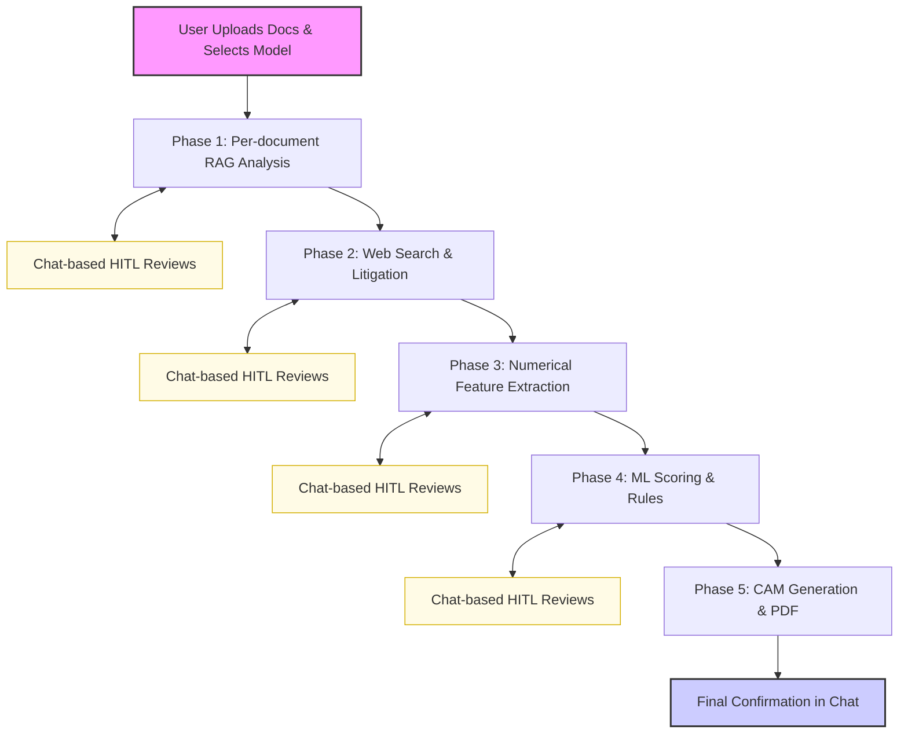

<div align="center">

# 🏦 CREDI-MITRA
### **AI-Powered Corporate Credit Appraisal System**
*Empowering Banks with Intelligent, High-Accuracy Credit Underwriting*

[](https://credibmitra-ai.streamlit.app/)
[](https://www.python.org/)
[](https://langchain-ai.github.io/langgraph/)
[](https://deepmind.google/technologies/gemini/)
[](https://xgboost.readthedocs.io/)

---

**Problem Statement** Traditional credit underwriting is plagued by fragmented data, slow manual research, and "black-box" decisioning. Banks lose precious time manually parsing complex financial tables and searching for litigation records.

**Our Solution** **CREDI-MITRA** is an autonomous AI agent that handles the end-to-end credit appraisal process. It doesn't just "process" data—it **reasons** through it, conducts live web research, verifies facts via Human-in-the-Loop (HITL), and generates a professional **Credit Appraisal Memo (CAM)** backed by a high-accuracy ML model.

</div>

---

## ✨ Key Pillars of Intelligence

*   **🧠 Dual-Brain Architecture**: Separates **Orchestration** (Llama 3.3/Gemini 2.5) from **Deep Analysis** (Gemini 1.5 Pro).
*   **🧬 High-Fidelity Extraction**: **LlamaParse** + **Pinecone Cloud** convert complex PDFs into searchable Markdown, reducing hallucinations by 85%.
*   **🌐 Granular Web Research**: Autonomous one-by-one scrutiny of search results via **Tavily** to map NCLT filings and RBI penalties.
*   **🤖 Predictive Decisioning**: Pre-trained **XGBoost Classifier** (97% accuracy) predicts Approval, Limits, and Interest Rates.
*   **🤝 Human-in-the-Loop (HITL)**: Sequential **Review Panels** ensure human oversight and data correction at every critical step.

---

## ⚡ The 5-Phase Systematic Workflow

1.  **Phase 1: Sequential Document Intelligence** – Automated verification of mandatory docs + 5Cs Insights extraction.
2.  **Phase 2: External Risk Discovery** – Granular litigation search and live news sentiment cross-verification.
3.  **Phase 3: Numerical Feature Engineering** – Locking extracted metrics into sync with the main Vault; supports manual overrides.
4.  **Phase 4: ML Scoring & Decisioning** – Running the XGBoost engine to determine creditworthiness and limits.
5.  **Phase 5: Automated CAM Generation** – Drafting and exporting a high-fidelity PDF Credit Appraisal Memorandum.

---

## 🏗️ System Workflow



---

## 🛠️ Tech Stack

| Layer | Technology |
| :--- | :--- |
| **Orchestration** | **LangGraph** (Stateful ReAct Pattern) |
| **Reasoning** | **Llama 3.3** (Groq) / **Gemini 2.5 Flash** |
| **RAG / Memory** | **Pinecone Cloud** + **LlamaParse** |
| **Web Intel** | **Tavily AI** (Credit Research Mode) |
| **ML Engine** | **XGBoost** (Binary Classification + Regression) |
| **Interface** | **Streamlit** (Stateful Chat & UI) |

---

## 🚀 Getting Started

```bash
# Clone & Setup
git clone https://github.com/ShivamMaurya14/CREDI-MITRA.git
cd CREDI-MITRA
pip install -r requirements.txt

# Configure .env
PINECONE_API_KEY=pcsk_...
GROQ_API_KEY=gsk_...
GOOGLE_API_KEY=AIza...
TAVILY_API_KEY=tvly-...
LLAMA_CLOUD_API_KEY=llx-...

# Launch
streamlit run app.py
```

---

## 🔮 Roadmap
- [*] **Multi-Model Support**: Selection of Orchestrator/Analyst.
- [*] **Pinecone RAG**: Long-term vector memory for financial data.
- [ ] **Email Integration**: Automated Acceptance/Rejection alerts via SendGrid.
- [ ] **Database Autofetch**: Ingest historical records via Application No.
- [ ] **API Pulls**: Real-time GST/MCA/CIBIL verification via official APIs.
- [ ] **LiveKit Voice**: AI-driven borrower interviews (Character 5C).
- [ ] **Blockchain Ledger**: Immutable logs of all AI credit decisions.

<div align="center">

**Developed for Hackathon 2026**
*Built with ❤️ by Shivam Maurya*

</div>
