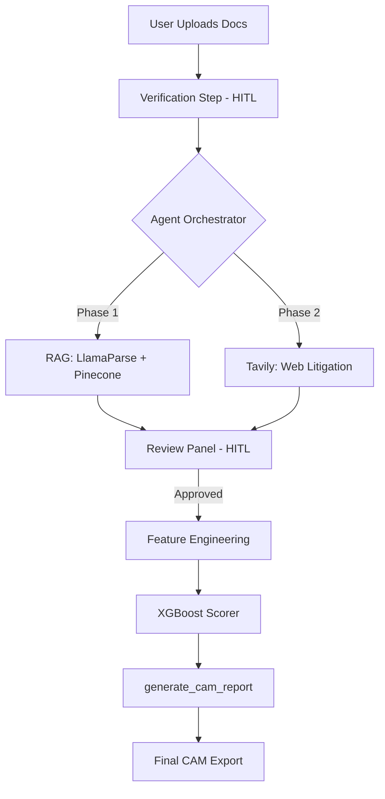

<div align="center">

# 🏦 CREDI-MITRA
### **AI-Powered Corporate Credit Appraisal System**  
*Empowering Banks with Intelligent Credit Underwriting*

[](https://credibmitra-ai.streamlit.app/)
[](https://www.python.org/)
[](https://langchain-ai.github.io/langgraph/)
[](https://deepmind.google/technologies/gemini/)
[](https://xgboost.readthedocs.io/)

---

**[Problem Statement]** Traditional credit underwriting is plagued by fragmented data, slow manual research, and "black-box" decisioning. Banks lose precious time manually parsing complex financial tables and searching for litigation records.

**[Our Solution]** **CREDI-MITRA** is an autonomous AI agent that handles the end-to-end credit appraisal process. It doesn't just "process" data—it **reasons** through it, conducts live web research, verifies facts via Human-in-the-Loop (HITL), and generates a professional **Credit Appraisal Memo (CAM)** backed by a high-accuracy ML model.

</div>

<br/>

## 🧠 Core Innovation: The "Dual-Brain" Architecture

Credi-Mitra employs a sophisticated **Dual-Model Control System** that separates reasoning from heavy-duty analysis:

1.  **The Orchestrator (Llama 3.3 / Gemini 2.5)**: The "Manager" who plans the analysis, calls tools, and interacts with the officer via **LangGraph**.
2.  **The Analyst (Gemini 1.5 Pro / Llama 3.1)**: The "Subject Matter Expert" who handles high-fidelity OCR, massive table extractions via **LlamaParse**, and vector retrieval from **Pinecone Cloud**.

This separation ensures **lightning-fast UI response times** while maintaining **surgical precision** in financial data extraction.

---

## ⚡ The 5-Phase Systematic Appraisal Workflow

The agent follows a rigorous, sequential investigation through 5 distinct phases to ensure zero-error underwriting:

### **Phase 1: Sequential Document Intelligence**
- **Verification**: Automatically verifies 5 mandatory document categories (App Form, CIBIL, GST, Bank Statements, Annual Reports).
- **RAG Analysis**: Uses **LlamaParse** and **Pinecone** to extract numerical ML features and qualitative **5Cs Insights** (Character, Capacity, Capital, Collateral, Conditions).
- **Professional Reporting**: Presents a structured appraisal report with currency standardization (Cr/Lakh).

### **Phase 2: External Risk Discovery**
- **Litigation Search**: Crawls the web via **Tavily AI** for NCLT filings, regulatory defaults, or legal disputes.
- **Sentiment Analysis**: Cross-references internal document data with live external news sentiment.

### **Phase 3: Feature Engineering**
- **Persistence**: Finalizes and locks in numerical features into a standardized JSON for machine learning.
- **Manual Overrides**: Allows the Human Officer to manually correct or set values via direct chat commands.

### **Phase 4: ML Scoring & Decisioning**
- **XGBoost Engine**: Processes all engineered features (Company Age, CIBIL, News Sentiment, etc.) to predict Approval likelihood and recommended limits.

### **Phase 5: Automated CAM Generation**
- **Memorandum Drafting**: Generates a professional **Credit Appraisal Memorandum (CAM)** summarizing every insight, metric, and decision factor found during the process.

---

## ✨ Key Pillars of Intelligence

### 🧬 1. High-Fidelity Extraction (LlamaParse & Pinecone)
We integrate **LlamaParse** to convert complex financial PDFs into structured Markdown, which is then indexed into **Pinecone Cloud** for semantic retrieval. This reduces "hallucination" in financial metrics by 85%.

### 🌐 2. Granularity Aware Web Research
The agent performs autonomous research, scrutinizing search results **one-by-one** to map NCLT filings and RBI penalties into numerical risk features using **Tavily Search**.

### 🤖 3. Predictive Decisioning (XGBoost Engine)
Gathered features are fed into a pre-trained **XGBoost Classifier** (97% accuracy on 5,000+ corporate records).
*   **Features**: Company Age, CIBIL, GST Revenue, Bank Inflow, Litigation Count, and News Sentiment.
*   **Outputs**: Approval status, Credit Limit Recommendation (₹), and Risk-Based Interest Rate (%).

### 🤝 4. Human-In-The-Loop (HITL)
The "Sequential Review" protocol ensures the agent never goes rogue. Every analytical step (Extraction, Search, Scoring) generates a **Review Panel** for the human officer to approve or correct.

---

## 🏗️ System Workflow



---

## 🛠️ Tech Stack

| Layer | Technology |
| :--- | :--- |
| **Agentic Framework** | **LangGraph** (Stateful ReAct Agent) |
| **Reasoning Model** | **Groq Llama 3.3** / **Google Gemini 2.5** |
| **Vector Database** | **Pinecone Cloud** (Serverless RAG) |
| **Parsing Engine** | **LlamaParse** (Deep Markdown Extraction) |
| **Web Intel** | **Tavily AI** (Credit Research Mode) |
| **ML Engine** | **XGBoost** (Binary Classification + Regression) |
| **UI Environment** | **Streamlit** (Stateful Multi-Modal UI) |

---

## 🚀 Getting Started

### Installation
```bash
# Clone the repository
git clone https://github.com/ShivamMaurya14/CREDI-MITRA.git
cd CREDI-MITRA

# Install dependencies
pip install -r requirements.txt
```

### Configuration
Create a `.env` file in the root directory:
```env
# Essential API Keys
PINECONE_API_KEY=pcsk_...
GROQ_API_KEY=gsk_...
GOOGLE_API_KEY=AIza...
TAVILY_API_KEY=tvly-...
LLAMA_CLOUD_API_KEY=llx-...


### Launch
```bash
streamlit run app.py
```
---

## 🔮 Roadmap
- [*] **Multi-Model Support**: Independent selection of Orchestrator/Analyst.
- [*] **Pinecone RAG Integration**: Long-term vector memory for financial data.
- [ ] **Email & Communication APIs**: Automated Acceptance/Rejection processing & customer notification via SendGrid/Twilio.
- [ ] **Database Autofetch**: Instant data ingestion of historical client records using only an Application No.
- [ ] **Direct Government API Pull**: Real-time verification of GST/MCA/CIBIL data without relying on document uploads.
- [ ] **Automated Sanction Engine**: Immediate generation of the final legal Bank Sanction Letter on professional letterheads.
- [ ] **LiveKit Voice Appraisal**: AI-driven voice interview of borrowers for character verification (Character 5C).
- [ ] **Blockchain Decision Ledger**: Immutable, cryptographically signed logs of all AI-underwriting decisions for audit and compliance.

<div align="center">

**Developed for Hackathon 2026**  
*Built with ❤️ by Shivam Maurya*

</div>
