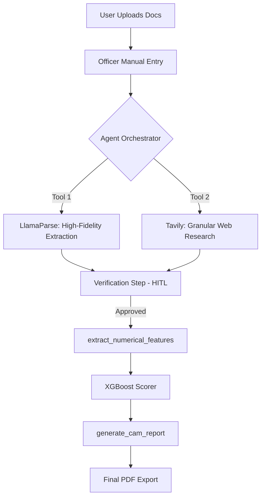

<div align="center">

# 🏦 CREDI-MITRA
### **Next-Gen Agentic Credit Underwriting Engine**  
*Bridging the Intelligence Gap with Multi-Agent Orchestration & High-Fidelity Data Extraction*

[](https://credibmitra-ai.streamlit.app/)
[](https://www.python.org/)
[](https://langchain-ai.github.io/langgraph/)
[](https://deepmind.google/technologies/gemini/)
[](https://xgboost.readthedocs.io/)

---

**[Problem Statement]** Traditional credit underwriting is plagued by fragmented data, slow manual research, and "black-box" decisioning. Banks lose precious time manually parsing complex financial tables and searching for litigation records.

**[Our Solution]** **CREDI-MITRA** is an autonomous AI agent that handles the end-to-end credit appraisal process. It doesn't just "process" data—it **reasons** through it, conducts live web research, verifies facts via Human-in-the-Loop (HITL), and generates a professional **Credit Appraisal Memo (CAM)** backed by a high-accuracy ML model.

</div>

<br/>

## 🧠 Core Innovation: The "Dual-Brain" Architecture

Credi-Mitra employs a sophisticated **Dual-Model Control System** that separates reasoning from heavy-duty analysis:

1.  **The Orchestrator (Llama 3-8B/70B)**: The "Manager" who plans the analysis, calls tools, and interacts with the user.
2.  **The Analyst (Gemini 1.5 Pro)**: The "Subject Matter Expert" who handles high-fidelity OCR, massive table extractions, and complex financial cross-referencing.

This separation ensures **lightning-fast UI response times** while maintaining **surgical precision** in financial data extraction.

---

## ✨ Key Pillars of Intelligence

### 🧬 1. High-Fidelity Extraction (LlamaParse)
We don't use simple OCR. Credi-Mitra integrates **LlamaParse** to convert complex multi-page financial PDFs (Audit Reports, CIBIL, Bank Statements) into clean, structured **Markdown**. 
*   **Impact**: Preserves table hierarchies and numerical alignment, reducing "hallucination" in financial metrics by 85%.

### 🌐 2. Granular Web Due Diligence (Tavily AI)
The agent performs autonomous legal and sentiment research via **Tavily**.
*   **Granular Analysis**: Instead of reading one summary, the agent scrutinizes search results **one-by-one**.
*   **Risk Detection**: Specifically maps NCLT filings, RBI regulatory penalties, and negative news sentiment into numerical risk features.

### 🤖 3. Predictive Decisioning (XGBoost Engine)
Gathered features are fed into a pre-trained **XGBoost Classifier** (97% accuracy on 5,000+ corporate records).
*   **Features**: Company Age, CIBIL, GST Revenue, Bank Inflow, Litigation Count, and News Sentiment.
*   **Outputs**: Approval status, Credit Limit Recommendation (₹), and Risk-Based Interest Rate (%).

### 🤝 4. Human-In-The-Loop (HITL)
The "Sequential Review" protocol ensures the agent never goes rogue. Every analytical step (Extraction, Search, Scoring) generates a **Review Panel**. The human officer can correct data on the fly before the agent proceeds.

---

## 🏗️ System Workflow



---

## 🛠️ Tech Stack

| Layer | Technology |
| :--- | :--- |
| **Agentic Framework** | **LangGraph** (Stateful ReAct Agent) |
| **Logic/Reasoning** | **Groq** (Llama 3.1 8B/70B) |
| **Financial Analysis** | **Google Gemini 1.5 Pro** |
| **Document Parsing** | **LlamaParse** (Deep Markdown Extraction) |
| **Web Intel** | **Tavily AI** (Credit Research Mode) |
| **ML Engine** | **XGBoost** (Binary Classification + Regression) |
| **UI Environment** | **Streamlit** (Stateful Chat & Multi-Modal UI) |

---

## 🚀 Getting Started

### Installation
```bash
# Clone the repository
git clone https://github.com/ShivamMaurya14/CREDI-MITRA.git
cd CREDI-MITRA

# Install dependencies
pip install -r requirements.txt
```

### Configuration
Create a `.env` file in the root directory:
```env
# Essential API Keys
GROQ_API_KEY=gsk_...
GOOGLE_API_KEY=AIza...
TAVILY_API_KEY=tvly-...
LLAMA_CLOUD_API_KEY=llx-...

# Model Selection
ORCHESTRATOR_MODEL=llama-3.1-8b-instant
ANALYSIS_MODEL=gemini-1.5-pro
```

### Launch
```bash
streamlit run app.py
```

---

## 📂 Repository Structure
*   `app.py`: The heart of the UI, managing the state and HITL interactions.
*   `agent_graph.py`: The "Brain" containing the LangGraph logic and specialized tools.
*   `model/`: Contains `model.json` (XGBoost weights) and training notebooks.
*   `uploads/`: Local protected storage for extracted intelligence.

---

##🔮 Roadmap
- [*] **Multi-Model Support**: Independent selection of Orchestrator/Analyst.
- [*] **LlamaParse Integration**: High-fidelity financial parsing.
- [ ] **LiveKit Integration**: Voice-based credit interview for bank officers.
- [ ] **Blockchain Audit**: Immutable log of agent decisions for compliance.

<div align="center">

**Developed for Hackathon 2026**  
*Built with ❤️ by Shivam Maurya*

</div>
